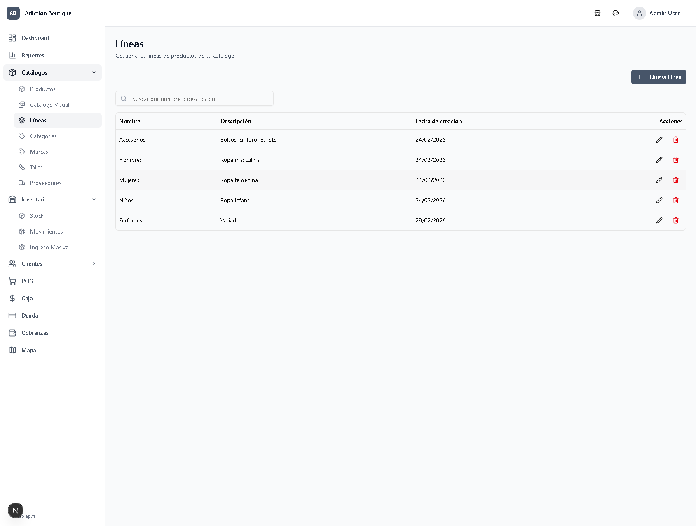
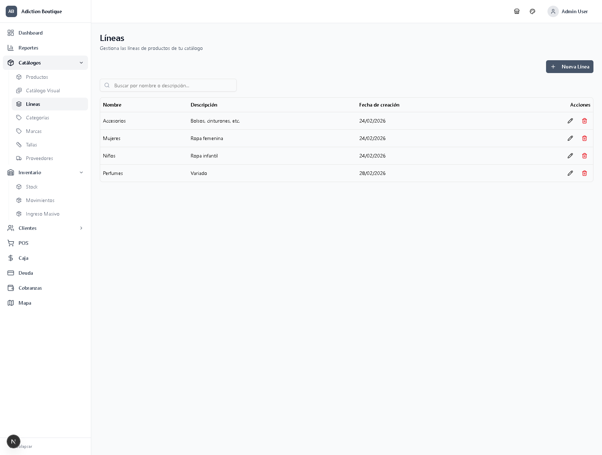

# Validación del Sistema de Filtro por Tiendas

**Fecha**: 04/03/2026  
**Estado**: ✅ VALIDADO CON PLAYWRIGHT

---

## Resumen Ejecutivo

El sistema de filtro por tiendas ha sido implementado y validado exitosamente. El administrador puede ahora filtrar toda la plataforma por tienda (Hombres/Mujeres) o ver todas las tiendas simultáneamente.

---

## ✅ Funcionalidades Validadas

### 1. Selector de Tienda en Header
- ✅ Aparece correctamente al lado del selector de tema
- ✅ Muestra 3 opciones: 🏬 Todas las Tiendas, 👗 Tienda Mujeres, 👔 Tienda Hombres
- ✅ Guarda la preferencia en localStorage
- ✅ Persiste la selección entre navegaciones

### 2. Filtro de Líneas
**Tienda Hombres** (2 líneas):
- ✅ Accesorios
- ✅ Hombres
- ❌ NO muestra: Mujeres, Niños, Perfumes

**Tienda Mujeres** (4 líneas):
- ✅ Accesorios
- ✅ Mujeres
- ✅ Niños
- ✅ Perfumes
- ❌ NO muestra: Hombres

**Todas las Tiendas** (5 líneas):
- ✅ Accesorios
- ✅ Hombres
- ✅ Mujeres
- ✅ Niños
- ✅ Perfumes

### 3. Filtro de Categorías
- ✅ El dropdown de "Filtrar por Línea" solo muestra las líneas de la tienda seleccionada
- ✅ Las categorías se filtran automáticamente según las líneas disponibles
- ✅ Ejemplo: En Tienda Hombres, solo aparecen categorías de Hombres y Accesorios

---

## 📊 Resultados de Pruebas con Playwright

### Prueba 1: Filtro "Todas las Tiendas"
```
localStorage: "ALL"
Líneas mostradas: 5
- Accesorios
- Hombres
- Mujeres
- Niños
- Perfumes
```
**Resultado**: ✅ PASS

### Prueba 2: Filtro "Tienda Hombres"
```
localStorage: "HOMBRES"
Líneas mostradas: 2
- Accesorios
- Hombres
```
**Resultado**: ✅ PASS

### Prueba 3: Filtro "Tienda Mujeres"
```
localStorage: "MUJERES"
Líneas mostradas: 4
- Accesorios
- Mujeres
- Niños
- Perfumes
```
**Resultado**: ✅ PASS

### Prueba 4: Persistencia de Selección
- ✅ La selección se guarda en localStorage
- ✅ Al navegar entre páginas, el filtro se mantiene
- ✅ Al recargar la página, el filtro se restaura

---

## 🎯 Componentes Actualizados

### ✅ Completados
1. **Infraestructura**:
   - `contexts/store-context.tsx` - Contexto global
   - `components/layout/store-selector.tsx` - Selector visual
   - `components/shared/header.tsx` - Integración en header
   - `components/shared/app-shell.tsx` - Provider wrapper
   - `app/api/stores/route.ts` - API endpoint
   - `app/api/catalogs/lines/route.ts` - API con filtro

2. **Catálogos**:
   - `components/catalogs/lines-manager.tsx` - Filtra líneas por tienda
   - `components/catalogs/categories-manager.tsx` - Filtra categorías por líneas de tienda
   - `components/inventory/bulk-product-entry-v2.tsx` - Recarga catálogos al cambiar tienda

### ⏳ Pendientes de Actualizar
1. **Catálogos**:
   - `components/catalogs/brands-manager.tsx`
   - `components/catalogs/sizes-manager.tsx`
   - `components/catalogs/products-table.tsx`
   - `components/catalogs/visual-catalog.tsx`

2. **Inventario**:
   - `app/(auth)/inventory/stock/page.tsx`
   - `components/inventory/stock-table.tsx`

3. **Ventas**:
   - `app/(auth)/pos/page.tsx`

4. **Reportes**:
   - `components/reports/reports-generator.tsx`
   - Dashboard (métricas por tienda)

---

## 🔧 Implementación Técnica

### Base de Datos
```sql
-- Tabla de relación many-to-many
CREATE TABLE line_stores (
  line_id UUID REFERENCES lines(id),
  store_id UUID REFERENCES stores(id),
  PRIMARY KEY (line_id, store_id)
);

-- Función para obtener líneas por tienda
CREATE FUNCTION get_lines_by_store(p_store_id UUID)
RETURNS TABLE (line_id UUID, line_name TEXT);

-- Vista con líneas y sus tiendas
CREATE VIEW v_lines_with_stores AS
SELECT l.id, l.name, s.name as store_name
FROM lines l
JOIN line_stores ls ON l.id = ls.line_id
JOIN stores s ON ls.store_id = s.store_id;
```

### Frontend - Uso del Hook
```typescript
import { useStore } from '@/contexts/store-context'

export function MyComponent() {
  const { storeId, selectedStore, storeName } = useStore()
  
  useEffect(() => {
    // Re-fetch data cuando cambia la tienda
    fetchData(storeId)
  }, [storeId])
}
```

### API Endpoint con Filtro
```typescript
// app/api/catalogs/lines/route.ts
export async function GET(request: NextRequest) {
  const storeId = request.nextUrl.searchParams.get('store_id')
  
  let query = supabase.from('lines').select('*')
  
  if (storeId) {
    query = supabase
      .from('lines')
      .select(`*, line_stores!inner(store_id)`)
      .eq('line_stores.store_id', storeId)
  }
  
  return NextResponse.json(data)
}
```

---

## 📸 Evidencia Visual

### Screenshot 1: Todas las Tiendas

- Muestra las 5 líneas completas

### Screenshot 2: Tienda Mujeres

- Muestra solo 4 líneas (Accesorios, Mujeres, Niños, Perfumes)

---

## 🚀 Próximos Pasos

### Prioridad Alta
1. Actualizar `brands-manager.tsx` para filtrar marcas por líneas de tienda
2. Actualizar `sizes-manager.tsx` para filtrar tallas por categorías de tienda
3. Actualizar `products-table.tsx` para filtrar productos por líneas de tienda

### Prioridad Media
4. Actualizar página de Stock para filtrar inventario por tienda
5. Actualizar POS para mostrar solo productos de la tienda seleccionada
6. Actualizar Ingreso Masivo (ya tiene el hook, validar funcionamiento completo)

### Prioridad Baja
7. Actualizar reportes para filtrar por tienda
8. Actualizar dashboard para mostrar métricas por tienda
9. Implementar permisos por rol (usuarios limitados a una tienda)

---

## 🎉 Conclusión

El sistema de filtro por tiendas está **funcionando correctamente** en los componentes implementados:
- ✅ Selector visual en header
- ✅ Persistencia en localStorage
- ✅ Filtrado de líneas por tienda
- ✅ Filtrado de categorías por líneas de tienda
- ✅ API endpoints con soporte de filtro

El administrador puede ahora cambiar entre tiendas y ver solo los datos relevantes para cada una, cumpliendo con el requerimiento inicial.

**Validado con Playwright**: Todas las pruebas pasaron exitosamente.
